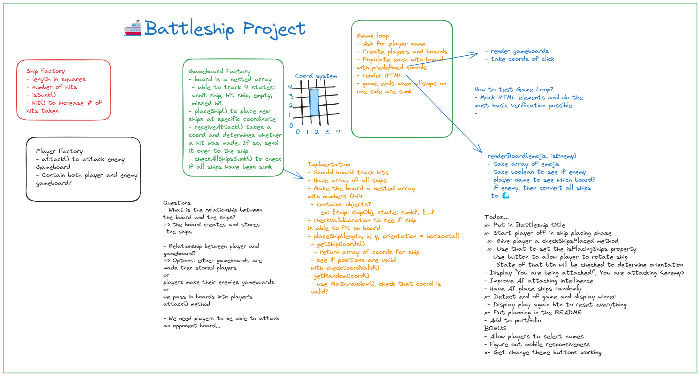

# Battleship TDD
This is the first major project I made with Test Driven Development. I learned the following:

- Well written tests document themselves and enable the reader to not even have to look at my code to understand what it does
- Deciding exactly what and what not to unit test is crucial to extensibility of my code
- It's a pain separating DOM manipulation from game logic and I now have a better appreciation for frameworks like React


## Planning
Here is some of the planning I did for this project from Excalidraw.


## Webpack
- This webpack set up with the following:
```
Eslint, prettier(must have extension), babel preloader, source maps, asset handling
```

## Getting Started
```npm install```
```npm run watch```